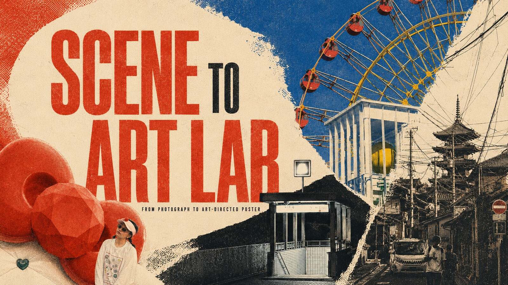
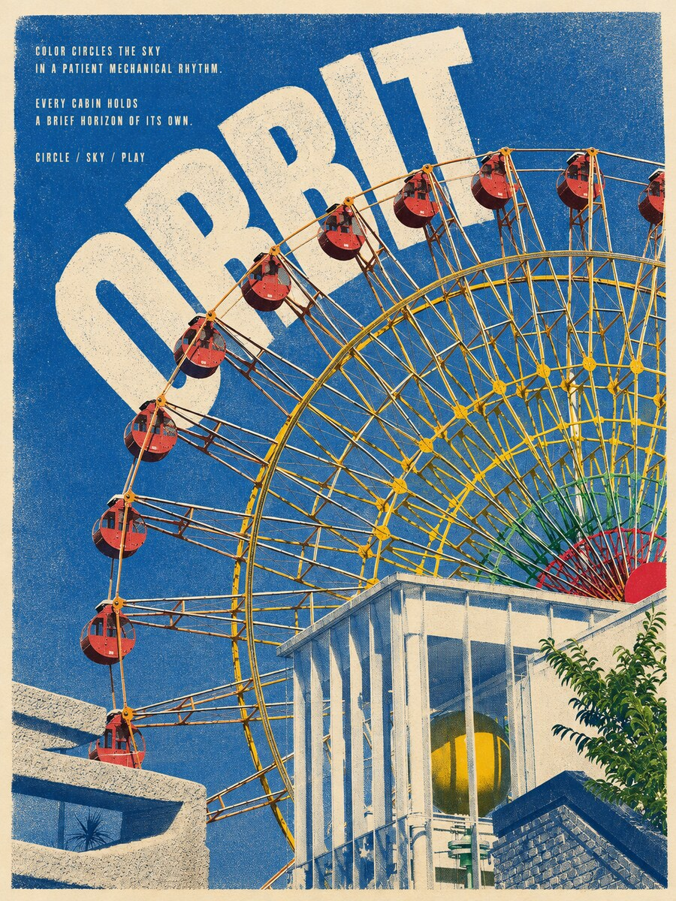

<p align="center">
  
</p>

<h1 align="center">Scene to Art Lab</h1>

<p align="center">
  Transform photographs into original art-directed posters through
  source-specific composition, color, material, typography and spatial design.
</p>

<p align="center">
  <strong>PHOTOGRAPH → VISUAL ANALYSIS → ART DIRECTION → POSTER</strong>
</p>

---

## Overview

Scene to Art Lab transforms user-supplied photographs into original
vertical 3:4 art posters while preserving the defining identity cues
of the source image.

Rather than applying a uniform visual filter, the Skill analyzes the
subject, composition, color, spatial relationships and emotional energy
of each photograph before selecting an appropriate artistic medium,
poster structure and typography system.

## Core Capabilities

- Analyze portraits, objects, vehicles, architecture and travel photography
- Preserve important identity cues while redesigning the composition
- Select an appropriate artistic medium based on the source image
- Generate vertical 3:4 art-directed posters
- Build individual posters or visually unified poster series
- Integrate large English titles with subject geometry
- Add restrained editorial micro-copy to enrich visual hierarchy
- Create source-derived color palettes and material treatments
- Use intentional negative space and lost-edge transitions
- Maintain one consistent typography system across a poster series

## Generated Example

<p align="center">
  
</p>

<p align="center">
  <em>A user-supplied photograph reinterpreted as an original editorial art poster.</em>
</p>

## Poster System

Every poster is constructed around four visual layers:

1. A recognizable identity anchor from the supplied photograph
2. A deliberately redesigned composition
3. A source-specific artistic medium and color palette
4. A unified editorial typography system

The title may overlap, frame, interrupt, crop or align with the subject.
Small English copy may appear as short editorial paragraphs,
metadata-like fragments or directional text.

Typography remains visually consistent across a series, while scale,
position, angle and image interaction respond to each individual scene.

## Supported Art Modes

- Transparent watercolor
- Pop-art screenprint
- Expressive painting
- Ink-wash
- Relief print
- Editorial surrealism
- Controlled hybrid

## Version 2.0

Version 2.0 expands the original art-transformation workflow with:

- image-and-title interlocking compositions;
- scene-specific English micro-copy;
- multiple poster layout angles and directions;
- stronger visual hierarchy;
- improved typography consistency across poster series;
- more flexible relationships between image, text and negative space;
- an updated GitHub cover and generated example presentation.

## Installation

Run:

```bash
npx skills add https://github.com/N1kO724/scene-to-art-lab --skill scene-to-art-lab
```

If the Skill does not appear immediately after installation, refresh or
reopen the Skills page.

## Usage

```text
@scene-to-art-lab

Analyze this photograph and transform it into an original vertical
3:4 art poster. Select the most suitable art mode and poster layout,
preserve its defining identity cues, and integrate scene-specific
English typography.
```

The user may specify:

- a preferred artistic medium;
- a single poster or unified poster series;
- large typography, editorial micro-copy or no typography;
- exact wording that must appear;
- a preferred visual mood or composition direction.

## Repository Structure

```text
scene-to-art-lab/
├── README.md
├── LICENSE
├── docs/
│   └── images/
│       ├── cover.jpg
│       └── gallery-01.jpg
└── scene-to-art-lab/
    ├── SKILL.md
    ├── LICENSE.txt
    ├── agents/
    │   └── openai.yaml
    ├── assets/
    │   └── icon.svg
    └── references/
        ├── art-modes.md
        ├── poster-systems.md
        └── typography.md
```

## License

Source-available for personal, non-commercial use only.

Commercial, professional, organizational, client, promotional and
monetized use requires prior written authorization.

See [LICENSE](LICENSE).
